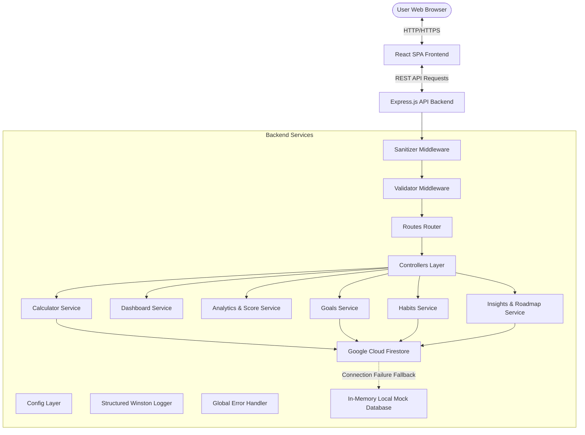

# C.A.R.B.O.N+ (Carbon Awareness, Reduction & Behavioral Optimization Navigator)

**Measure. Understand. Reduce.**

C.A.R.B.O.N+ is a production-grade, highly responsive Carbon Footprint Awareness Web Application that helps individuals compute, monitor, and reduce their greenhouse gas emissions through custom analytics, green habits log, and personalized sustainability feedback.

---

## 1. Problem Statement
Global greenhouse gas emissions continue to rise, accelerating climate change. While many individuals want to help, they lack clear visibility into which everyday activities (such as driving a car, home energy usage, dietary habits, and waste disposal) contribute the most. Without actionable tracking and tangible reduction goals, sustainable behavioral shifts remain difficult to achieve.

## 2. Solution Overview
C.A.R.B.O.N+ solves this by providing:
- An intuitive, multi-lingual Carbon Footprint Calculator.
- Real-time aggregations (Daily, Weekly, Monthly, Yearly footprints).
- Interactive, responsive analytics to trace trends and habit offsets.
- Actionable target goals and a gamified Green Habit tracker to cultivate sustainable behaviors.
- Highly scalable, fail-safe cloud integration ready to deploy on GCP Cloud Run.

---

## 3. System Architecture



---

## 4. Technology Stack
- **Frontend**: React (v19), Vite, Lucide Icons, Pure CSS (Dark Theme, Backdrop glassmorphic layouts).
- **Backend**: Node.js (CommonJS), Express, Winston Logger, Helmet, Express Rate Limit.
- **Database**: Google Cloud Firestore (primary) / Local In-Memory Storage (development fallback).
- **LLM Integration**: Google Gemini API via HTTPS.

---

## 5. Google Services Integration
- **Google Cloud Firestore**: Primary database for logs, goals, and habits. Built with a robust fail-safe mechanism: if GCP config is missing, it seamlessly redirects writes/reads to local in-memory storage without crash.
- **Google Cloud Run**: Container-ready configurations using a multi-stage Docker build, exposing standard environment ports.
- **Google Cloud Logging**: Winston structured logger outputting production logs to console in native JSON format for automated stackdriver ingestion.

---

## 6. Key Endpoints
- `GET /api/health` - Health state and active database connection report.
- `POST /api/calculator` - Calculates and stores daily footprints.
- `GET /api/dashboard` - Returns grouped totals and logs history.
- `POST /api/goals` - Sets a carbon reduction target.
- `POST /api/habits` - Logs eco-friendly habits and carbon saved.
- `GET /api/analytics` - Fetches Eco Score and weekly SVG trend data.
- `GET /api/insights/roadmap` - Fetches the 30/60/90 day action plan generated using Gemini.
- `GET /api/insights/report` - Generates downloadable sustainability report text.

---

## 7. Security & Input Sanitization
- **Helmet Headers**: Blocks script injection and browser exploits.
- **API Rate Limiting**: Throttles rapid API requests.
- **CORS Policies**: Restricts API calls to approved origins.
- **Input Sanitization**: Custom middleware recursively strips HTML/Script tags to mitigate XSS attacks.
- **Secrets Protection**: Configured strictly through environment variables.

---

## 8. Development & Deployment Steps

### Quick Start (Local Development)
1. **Build Frontend**:
   ```bash
   cd frontend
   npm install
   npm run build
   ```
2. **Launch Backend**:
   ```bash
   cd ../backend
   npm install
   npm start
   ```
3. Open `http://localhost:8080` in your browser.

For containerized and GCP deployment guides, see [DEPLOYMENT.md](DEPLOYMENT.md).
For a full API reference, see [API_REFERENCE.md](API_REFERENCE.md).

---

## 9. Testing Strategy & Suite
The backend features Jest and Supertest unit and integration test coverage:
- **Run tests**: `npm run test` (executed from the `backend/` directory).
- **Target coverage**: 90%+ line coverage across all files.

---

## 10. Future Scope
- **IoT Smart Meter Integration**: Pull electricity consumption stats automatically.
- **GPS Commute Tracking**: Log commuting distances in the background.
- **Gamified Leagues**: User-versus-user sustainability challenges.
