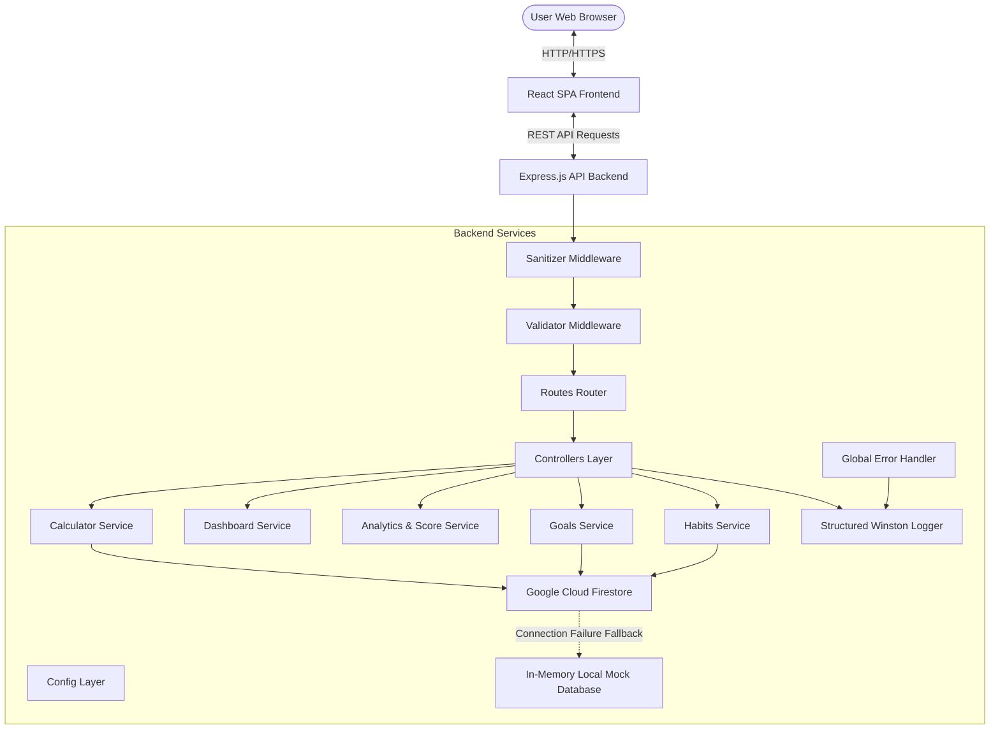

# C.A.R.B.O.N+ System Architecture

C.A.R.B.O.N+ is a production-grade Carbon Footprint Awareness Platform designed with a modular, reliable, and fail-safe architecture.

## Architecture Diagram

## Architectural Design Principles

1. **Modular Architecture**: Separate layers for Routing, Request Input Validation, Sanitization, Controllers, Core Services, Utilities, and Third-Party API clients.
2. **Fail-Safe Google Cloud Services**:
   - **Firestore Database**: All write and read operations go through a database wrapper service (`firestore.js`). If Firestore is unconfigured or a network error occurs, it dynamically falls back to an in-memory database, logging the failure structuredly without crashing the server.
   - **Cloud Logging**: Utilizes Winston configured to automatically outputs JSON-formatted logs under production, which are natively captured and parsed by Google Cloud Operations Suite (formerly Stackdriver) in Cloud Run.
3. **Security First**:
   - Helmet headers to block injection.
   - CORS controls allowing only safe clients.
   - Input sanitization middleware to recursively strip HTML tags from request body, query parameters, and route parameters to prevent XSS.
   - Strict rate limiting on API endpoints to prevent Brute-force/DDoS.
4. **Multi-Language System**: Client-side context system storing regional translation keys for English and 9 other Indian regional languages, enabling instant client-side switching with zero loading latency and full English fallback.
